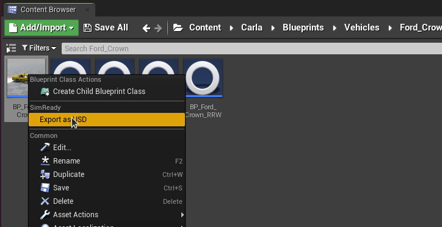
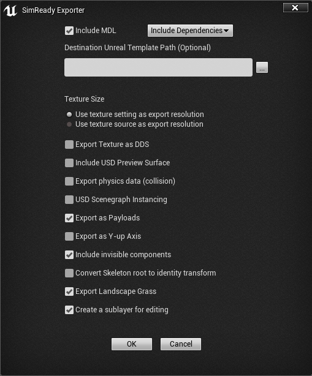

# NVIDIA SimReady

**SimReady** 是与用于模拟的 3D 资产相关的信息和元数据的标准规范。SimReady 标准确保 3D 资产不仅是数字孪生中的高保真视觉资源，而且还具有组织良好的元数据定义，包括语义标记、密集字幕、非视觉传感器信息和物理属性。

* __[SimReady 转换器](#simready-converter)__  
* __[使用 SimReady 转换器导出 SimReady 资产](#exporting-an-asset-with-the-simready-converter)__
    * [导出地图](#exporting-a-map)
    * [导出车辆或行人](#exporting-a-vehicle-or-a-pedestrian)
* __[SimReady 导出选项](#simready-export-options)__
* __[语义标签和 Q-codes](#semantic-labels-and-q-codes)__

## SimReady 转换器

NVIDIA SimReady 转换器使 CARLA 资产能够以符合 SimReady 标准的方式导出为通用场景描述 （USD） 格式，从而有助于从 OmniVerse 生态系统导入到其他应用程序中，例如 Sensor RTX 或 RTX 渲染器以进行协同模拟。

SimReady转换器在可能的情况下将虚幻对象、属性和参数映射到符合 USD/SimReady 的等效项，并应用适当的元数据（例如语义标签）用于模拟目的。

### 使用 SimReady 转换器导出 SimReady 资产

#### 导出地图

要导出地图，请在 CARLA 内容浏览器(content browser) 中找到相应的地图文件。例如，`Content > Carla > Maps`中的 *Town10HD_Opt*。

在内容浏览器中双击地图资产以加载它。选择`File > Export All`。将`Save as type`设置为 *AV Sim 的通用场景描述二进制 SimReady 资产 (\*.usd)*。

选择资产的文件夹位置。单击 *保存(Save)* 选项后，将出现一个选项对话框。在大多数情况下，使用默认选项导出将有效。有关导出选项的更多详细信息，请参阅 [SimReady 选项](#simready-export-options) 部分。

#### 导出车辆或行人

要导出车辆或行人，请找到蓝图文件。例如，`Content >  Carla > Blueprints > Vehicles > Ford_Crown`中的 *BP_Ford_Crown*  或 `Content > Carla > Blueprints > Walkers` 中的 *BP_Walker*。右键单击蓝图并选择 *导出为 USD(Export as USD)*。

将打开一个文件浏览器，为导出的 USD 文件选择一个位置。选择 *保存(Save)* 后，将打开一个选项对话框。默认选项适用于大多数情况。

有关 SimReady 导出选项的更多详细信息，请参阅以下部分。

## SimReady 导出选项

两个最重要的选项如下：

* `Include MDL` - 选择此选项会将虚幻材质转换为 MDL 材质。确保您要导出的应用程序与 MDL 材质兼容。Omniverse Kit 应用程序与 MDL 材料兼容。

* `Include USD Preview Surface` - 选择此选项会导出带有 USD 预览表面的 USD，这可确保可视化的更广泛兼容性，但材质功能集更有限。这有助于确保在不支持完整 MDL 规范的应用程序中可以正确查看资产。

下表提供了有关可用导出选项的详细信息。更多详细信息可以在 Omniverse Connect 文档中找到 [点击此处](https://docs.omniverse.nvidia.com/connect/latest/ue4/manual.html#exporting-to-omniverse-as-usd-and-mdl) 。

| 选项                                                            | 结果                                                                                                                                                                                                                                                  | 
|---------------------------------------------------------------|-----------------------------------------------------------------------------------------------------------------------------------------------------------------------------------------------------------------------------------------------------|
| Export Method                                                 | 共享（Shared） 组织材质，以便它们可以由许多资源共享\n模块化（Modular） 为 每个资源导出一个材质，以便资源及其材质都是独立的 | 
| Include MDL                                                   | 导出 MDL 材料 
| MDL Dependency Option                                         | Include Dependencies - Duplicates the MDL dependencies (templates) in Destination Folder  Use Core Library Dependencies - Core MDL Library templates are referenced                                                                              | 
| Destination Unreal Template Path                              | Destination Folder on Omniverse Nucleus for the MDL dependencies (templates)  Note: A file must be selected, but only the folder is used                                                                                                         |
| Texture Size                                                  | Use Texture Setting or Source as Exported Texture Size                                                                                                                                                                                              |
| Export Texture as DDS                                         | Save DDS Files to Destination Path and reference them from materials                                                                                                                                                                                |
| Include USD Preview Surface                                   | Export Preview Surfaces                                                                                                                                                                                                                             |
| Include Unreal Materials                                      | Export a reference to an Unreal material (note, when importing/opening  the material must be available in the within the Unreal project)                                                                                                         |
| Create a material overrides layer                             | Export a sublayer that contains all of the material reference overs for the stage.   Also create USD files for each material rather than including them in the prop stages.                                                                      |
| Export physics data                                           | Include collision data with static meshes (not available with Unreal Engine 5.0 due to USD Schema updates)                                                                                                                                          |
| Export source geometry for  Nanite high-poly detailed mesh | Brute-force export the Nanite geometry as USD geometry data.  (only available with Unreal Engine 5.0, this generates a LOT of triangles)                                                                                                         |
| USD Scenegraph Instancing                                     | Make every referenced mesh in a stage an instance. If the stage has  duplicate meshes this can greatly reduce geometric GPU memory in  another renderer, but the editing workflow may be hampered.                                            |
| Export as Payloads                                            | Use Payloads instead of References in the stage                                                                                                                                                                                                     |
| Export as Y-up axis                                           | If checked, USD and MDL are exported with a Y-up  stage up-axis rather than the default Z-up                                                                                                                                                     |
| Export Sublevels as Sublayers                                 | If checked, levels are exported as USD sublayers  and referenced in the root stage                                                                                                                                                               |
| Convert Skeleton root to identity transform                   | This option will convert a Skeleton’s root node to an identity transform to assist  downstream tools that require this. All animations exported during this  export will be transformed properly so they’ll work in downstream tools.         |
| Include invisible levels                                      | If checked, levels that are hidden will be included  in the export and marked as invisible                                                                                                                                                       |
| Export Decal Actors as planes                                 | If checked, decal actors are exported as “floating”  plane meshes offset from their base mesh                                                                                                                                                    |
| Add extra extension to exports                                | Stage files will be named `.stage.usd`, props will be named `.prop.usd`                                                                                                                                                                             |
| Checkpoint Comment (Optional)                                 | Set the checkpoint comment on the Nucleus server for each exported file                                                                                                                                                                             |

## 语义标签和 Q代码

SimReady 标准使用 [Q 代码](https://en.wikipedia.org/wiki/Q_code) 进行语义标记。Q 代码是三个字母代码的标准化集合，这些代码都以字母 Q 开头。SimReady 导出器为从 CARLA 导出的每个语义标记项应用适当的 Q 代码，作为 USD 文件中对象元数据的一部分。您可以在 [维基数据网站](https://www.wikidata.org/wiki/Wikidata:Main_Page) 上查找 Q 代码定义。

下表显示了 CARLA 语义类到 Q 代码的映射：

| Label | Q-code |
|-------|--------|
| Road | Q34442 |
| SideWalk | Q177749 |
| Building | Q41176 |
| Wall | Q42948 |
| Fence | Q148571 |
| Pole | Q2180428 |
| TrafficLight | Q8004 |
| TrafficSign | Q170285 |
| Vegetation | Q187997 |
| Terrain | Q186131 |
| Sky | Q527 |
| Pedestrian | Q221488 |
| Rider | Q11998775 |
| Car | Q1420 |
| Truck | Q43193 |
| Bus | Q5638 |
| Train | Q870 |
| Motorcycle | Q34493 |
| Bicycle | Q11442 |
| Static | Q2302426 |
| Dynamic | Q2302426 |
| Other | Q55107540 |
| Water | Q283 |
| RoadLine | Q1392287 |
| Ground | Q36133 |
| Bridge | Q12280 |
| RailTrack | Q57498564 |
| GuardRail | Q1188866 |

